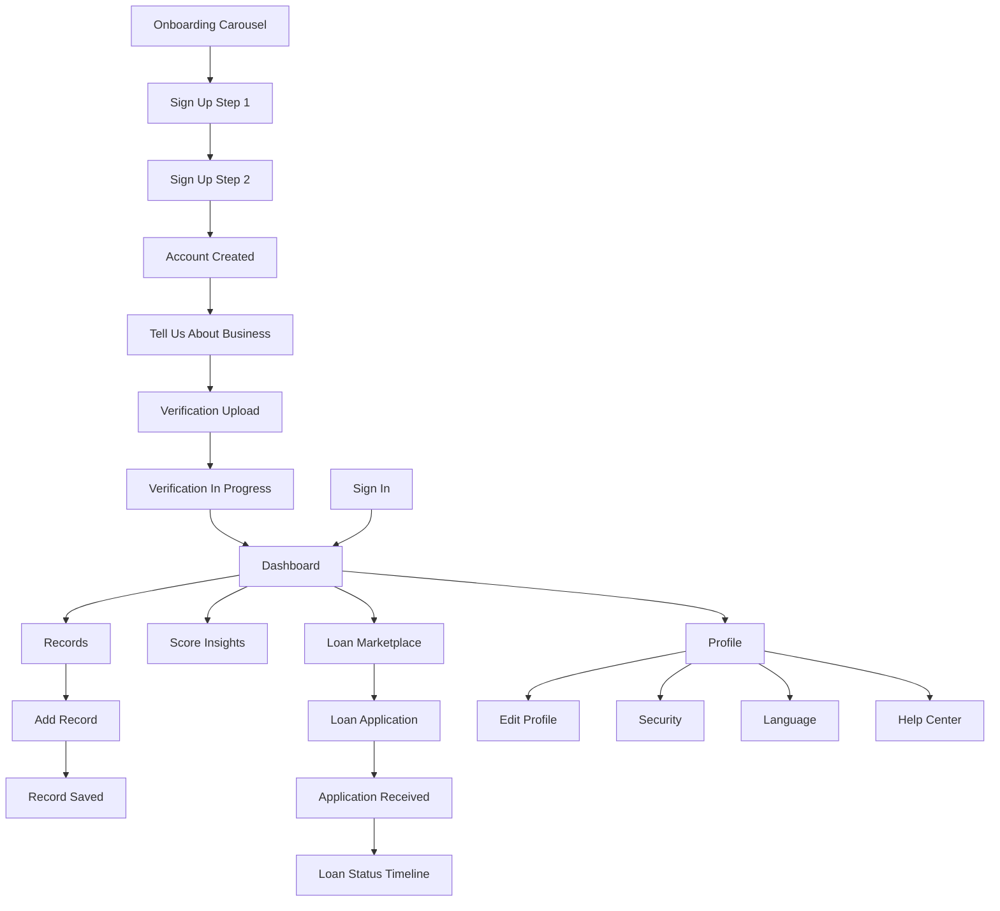

# Ikizere Score — Backend Requirements Document

**Version:** 1.0  
**Date:** June 24, 2026  
**Status:** Requirements only — no implementation  
**Source:** Analysis of 24 design screens in `/designs`

---

## 1. Executive Summary

**Ikizere Score** is a mobile-first fintech platform for small and medium business owners (primarily Rwanda / East Africa, currency **RWF**). The app helps users:

1. Track income, expenses, and savings manually
2. Build an **Ikizere Score** — a proprietary financial trust / credit score
3. Monitor loan readiness and eligibility
4. Browse a loan marketplace and submit loan applications
5. Complete KYC/KYB verification and manage account security

The backend must support authentication, document storage, financial record CRUD, score calculation, loan lifecycle management, notifications (SMS/email), multi-language preferences, and a CMS-style help center.

---

## 2. Application Architecture Overview

### 2.1 Recommended Stack Assumptions

| Layer | Recommendation |
|-------|----------------|
| API | REST (JSON), versioned under `/api/v1` |
| Auth | JWT access + refresh tokens; OAuth 2.0 for Google/Facebook |
| Database | MongoDB |
| File storage | S3-compatible object storage (KYC docs, profile images, loan attachments) |
| Notifications | SMS + email providers (Twilio, Africa's Talking, SendGrid, etc.) |
| Background jobs | Score recalculation, verification SLA tracking, notification dispatch |

### 2.2 Core Domain Modules

```
Auth & Identity ──► Users, Sessions, OAuth
Onboarding ───────► Business Profile, Verification (KYC/KYB)
Financial Records ► Transactions, Categories, Aggregates
Scoring Engine ───► Score History, Breakdown, Recommendations, Peer Stats
Loans ────────────► Products, Marketplace, Applications, Timeline
Support & Help ───► FAQs, Articles, Support Tickets
Settings ─────────► Security, Language, Notifications
```

### 2.3 User Lifecycle States

| State | Description |
|-------|-------------|
| `registered` | Account created (Sign Up complete) |
| `profile_incomplete` | Business details not yet submitted |
| `verification_pending` | Documents submitted, under review (24–48h SLA) |
| `verified` | KYC/KYB approved; trust tier unlocked |
| `active` | Full app access with score and records |

---

## 3. Screen-by-Screen Analysis

### 3.1 Onboarding Carousel (`Html → Body.png`)

**Purpose:** Introduce new users to three value pillars before sign-up.

| Slide | Message |
|-------|---------|
| 1 | Track financial activity (income, expenses, savings) |
| 2 | Build Ikizere Score through responsible habits |
| 3 | Access loans and financial services |

**User actions:** Swipe/next through slides; proceed to Sign Up or Sign In.

**Data to store:**
- `users.onboardingCompleted` (boolean)
- Optional: `users.onboardingCompletedAt`

**API endpoints:**
| Method | Endpoint | Description |
|--------|----------|-------------|
| PATCH | `/api/v1/users/me/onboarding` | Mark onboarding carousel as completed |

**MongoDB collections:** `users`

---

### 3.2 Sign In (`Sign in.png`)

**Purpose:** Authenticate returning users.

**User actions:**
- Enter email and password
- Toggle password visibility
- Tap "Forgot Password?"
- OAuth sign-in (Google, Facebook)
- Navigate to Sign Up

**Data to store:**
- `users.email` (unique, indexed)
- `users.passwordHash`
- `users.oauthProviders[]` — `{ provider, providerId, linkedAt }`
- `users.lastLoginAt`, `users.lastLoginLocation`
- `login_activities` — per-session audit row

**API endpoints:**
| Method | Endpoint | Description |
|--------|----------|-------------|
| POST | `/api/v1/auth/login` | Email/password login; returns tokens |
| POST | `/api/v1/auth/oauth/google` | Google OAuth token exchange |
| POST | `/api/v1/auth/oauth/facebook` | Facebook OAuth token exchange |
| POST | `/api/v1/auth/forgot-password` | Send password reset email/SMS |
| POST | `/api/v1/auth/reset-password` | Reset with token |
| POST | `/api/v1/auth/refresh` | Refresh access token |
| POST | `/api/v1/auth/logout` | Invalidate refresh token / session |

**MongoDB collections:** `users`, `refresh_tokens`, `login_activities`, `password_reset_tokens`

---

### 3.3 Sign Up — Step 1 of 2 (`Sign up.png`)

**Purpose:** Collect personal identity information.

**User actions:**
- Enter full name, phone number, national ID
- Continue to Step 2
- Navigate to Log In

**Data to store:**
- `users.fullName`
- `users.phoneNumber` (unique, E.164 format e.g. `+250788000000`)
- `users.nationalId` (unique, immutable after verification)
- `users.registrationStep` = `1`

**API endpoints:**
| Method | Endpoint | Description |
|--------|----------|-------------|
| POST | `/api/v1/auth/register/validate-step-1` | Validate uniqueness of phone & national ID |
| GET | `/api/v1/auth/register/draft` | Retrieve in-progress registration (optional) |

**MongoDB collections:** `users`, `registration_drafts` (optional, TTL-indexed)

**Validation rules:**
- National ID format validation (Rwanda: 16-digit format)
- Phone uniqueness check before Step 2

---

### 3.4 Sign Up — Step 2 of 2 (`Sign up (1).png`)

**Purpose:** Complete account creation with business type and credentials.

**User actions:**
- Select business type (dropdown)
- Set password and confirm password
- Accept Terms & Conditions and Privacy Policy
- Create account
- Navigate back or to Log In

**Data to store:**
- `users.businessTypeId` (ref → `business_types`)
- `users.passwordHash`
- `users.termsAcceptedAt`
- `users.privacyPolicyAcceptedAt`
- `users.registrationStep` = `2`
- `users.accountStatus` = `registered`
- `users.memberSince`
- `users.membershipTier` (default: `standard`)

**API endpoints:**
| Method | Endpoint | Description |
|--------|----------|-------------|
| GET | `/api/v1/reference/business-types` | List business type options |
| POST | `/api/v1/auth/register` | Finalize registration (Steps 1 + 2 payload) |

**MongoDB collections:** `users`, `business_types`

---

### 3.5 Account Created Successfully (`created.png`)

**Purpose:** Confirm registration success and route user to next step.

**User actions:**
- "Complete My Profile" → business onboarding flow
- "Go to Dashboard" → home (limited until profile complete)

**Data to store:**
- `users.profileCompletionStatus` = `account_created`

**API endpoints:**
| Method | Endpoint | Description |
|--------|----------|-------------|
| GET | `/api/v1/users/me/status` | Return account + profile completion state |
| PATCH | `/api/v1/users/me/profile-intent` | Track chosen path (analytics, optional) |

**MongoDB collections:** `users`

---

### 3.6 Tell Us About Your Business — Step 1 of 2 (`tell us.png`)

**Purpose:** Collect business demographics for credit assessment.

**User actions:**
- Enter business name, years in operation, employee count, monthly revenue (RWF)
- "Continue to Verification" → Step 2
- "Save as Draft"
- Bottom nav: Home, Score, Profile, Loans

**Data to store:**
- `business_profiles.userId`
- `business_profiles.businessName`
- `business_profiles.yearsInOperation` (enum or numeric)
- `business_profiles.employeeCount`
- `business_profiles.estimatedMonthlyRevenue` (RWF)
- `business_profiles.revenueAveragingMonths` (default: 6, per UI tip)
- `business_profiles.status` — `draft` | `submitted`
- `business_profiles.onboardingStep` = `1`

**API endpoints:**
| Method | Endpoint | Description |
|--------|----------|-------------|
| GET | `/api/v1/users/me/business-profile` | Fetch current business profile |
| PUT | `/api/v1/users/me/business-profile` | Save or submit business details |
| PATCH | `/api/v1/users/me/business-profile/draft` | Save as draft without advancing step |

**MongoDB collections:** `business_profiles`, `reference_years_in_operation` (optional enum)

---

### 3.7 Verification Step — Step 2 of 3 (`verify.png`)

**Purpose:** Collect KYC (identity) and KYB (business) documents.

**User actions:**
- Upload National ID front (PNG/JPG, max 10 MB)
- Upload National ID back (PNG/JPG, max 10 MB)
- Upload Trade License (PDF or scan)
- Complete profile / submit
- View Data Protection Policy; access help

**Data to store:**
- `verifications.userId`
- `verifications.idFrontUrl`, `verifications.idBackUrl`
- `verifications.tradeLicenseUrl`
- `verifications.status` — `pending` | `under_review` | `approved` | `rejected`
- `verifications.submittedAt`, `verifications.reviewedAt`
- `verifications.rejectionReason` (if rejected)
- `verifications.estimatedReviewHours` (24)
- `users.trustTier` (e.g. `emerald` — unlocked on approval)
- `users.onboardingStep` = `2`

**API endpoints:**
| Method | Endpoint | Description |
|--------|----------|-------------|
| POST | `/api/v1/verification/upload` | Multipart upload; returns file URLs |
| POST | `/api/v1/users/me/verification/submit` | Link uploaded docs and submit for review |
| GET | `/api/v1/verification/requirements` | Document requirements and constraints |
| GET | `/api/v1/users/me/verification/status` | Current verification status |

**MongoDB collections:** `verifications`, `users`

**Admin/internal endpoints (future):**
- `PATCH /api/v1/admin/verifications/:id` — approve/reject

---

### 3.8 Verification in Progress (`process.png`)

**Purpose:** Post-submission status screen while documents are reviewed.

**User actions:**
- View status ("Under Review", ETA 24–48 hours)
- Go to Dashboard
- View My Profile
- Explore suggested next steps (informational)

**Data to store:** (read from existing collections)
- `verifications.status` = `under_review`
- `verifications.estimatedCompletionAt`

**API endpoints:**
| Method | Endpoint | Description |
|--------|----------|-------------|
| GET | `/api/v1/users/me/verification/status` | Status, ETA, next-step suggestions |

**MongoDB collections:** `verifications`, `users`

---

### 3.9 Home Dashboard (`page (1).png`)

**Purpose:** Primary financial health overview for authenticated users.

**User actions:**
- View Ikizere Score summary (+12 pts this month)
- "View Score Insights" → Score detail
- View loan readiness (85%)
- "Check Loan Offers" → Loan marketplace
- View financial summary cards (income, savings, expenses, net cash flow)
- Act on recommendations (savings, credit mix)
- View recent activity (last 3 transactions); "See All"
- Bottom nav across Home, Records, Score, Loans, Profile
- Notifications bell

**Data to store:**
- `scores` — current score, rating label, monthly delta
- `financial_summaries` — pre-aggregated monthly metrics per user
- `financial_records` — source transactions
- `score_recommendations` — personalized tips
- `notifications` — unread count

**API endpoints:**
| Method | Endpoint | Description |
|--------|----------|-------------|
| GET | `/api/v1/dashboard/summary` | Score, readiness, financial summary in one payload |
| GET | `/api/v1/dashboard/recommendations` | Top recommendations for dashboard |
| GET | `/api/v1/transactions/recent?limit=3` | Recent transactions |
| GET | `/api/v1/notifications/unread-count` | Badge count for bell icon |
| GET | `/api/v1/users/me/greeting` | Name + time-based greeting ("Good Morning, Sheilla") |

**MongoDB collections:** `users`, `scores`, `score_history`, `financial_summaries`, `financial_records`, `score_recommendations`, `notifications`

---

### 3.10 Records List (`records.png`)

**Purpose:** Transaction ledger with search, filters, and monthly insights.

**User actions:**
- Add new record (+ button)
- Search transactions
- Filter by All / Income / Expenses / Savings
- View grouped transaction list (by date)
- View monthly overview insight ("Healthy Growth", +12% income vs last month)

**Data to store:**
- `financial_records` — full transaction documents (see §3.11)
- Aggregated monthly income/expense for insight card

**API endpoints:**
| Method | Endpoint | Description |
|--------|----------|-------------|
| GET | `/api/v1/records` | Paginated list; query: `type`, `search`, `from`, `to`, `page` |
| GET | `/api/v1/records/insights/monthly` | Month-over-month growth summary |

**MongoDB collections:** `financial_records`, `record_categories`

**Indexes:**
- `{ userId: 1, date: -1 }`
- `{ userId: 1, type: 1, date: -1 }`
- Text index on `title`, `description`

---

### 3.11 Add Record (`add record.png`, `add record (1).png`)

**Purpose:** Manual entry of income, expense, or savings transactions.

**User actions:**
- Switch tab: Add Income | Add Expense | Add Savings
- Enter amount (RWF), category, date, optional description
- Save record

**Data to store:**
- `financial_records.userId`
- `financial_records.type` — `income` | `expense` | `savings`
- `financial_records.amount` (decimal)
- `financial_records.currency` — `RWF`
- `financial_records.categoryId` (ref → `record_categories`)
- `financial_records.categoryLabel` (denormalized for display)
- `financial_records.date`
- `financial_records.description`
- `financial_records.paymentMethod` — e.g. `business_account`, `mobile_money`, `bank_transfer`, `utility`, `credit_line`
- `financial_records.verificationStatus` — `verified` | `pending`
- `financial_records.createdAt`, `updatedAt`
- `audit_logs` — immutable creation event

**API endpoints:**
| Method | Endpoint | Description |
|--------|----------|-------------|
| GET | `/api/v1/records/categories?type={income\|expense\|savings}` | Category dropdown options |
| POST | `/api/v1/records` | Create new financial record |
| GET | `/api/v1/records/:id` | Fetch single record (confirmation screen) |

**MongoDB collections:** `financial_records`, `record_categories`, `audit_logs`

**Side effects on create:**
- Trigger async score recalculation job
- Update `financial_summaries` aggregates

---

### 3.12 Record Saved Confirmation (`saved.png`)

**Purpose:** Confirm successful record creation with summary.

**User actions:**
- View record summary (amount, category, date, verified badge)
- "View All Records"
- "Add Another Record"

**Data to store:** Same as §3.11 (returned in POST response).

**API endpoints:**
| Method | Endpoint | Description |
|--------|----------|-------------|
| POST | `/api/v1/records` | (creates record; response powers this screen) |
| GET | `/api/v1/records/:id` | Fetch saved record details |

**MongoDB collections:** `financial_records`, `audit_logs`

---

### 3.13 Score Insights / Score Detail (`insights.png`)

**Purpose:** Deep dive into Ikizere Score — breakdown, peer comparison, recommendations.

**User actions:**
- View current score (471), rating (EXCELLENT), +12 change (30 days)
- View score breakdown by factor with weights and user percentages
- View peer comparison (top 5% in district)
- Tap recommendations (Boost Savings, Early Repayment, Digital Records)
- Back navigation; notifications; bottom nav

**Data to store:**
- `scores.currentScore`, `scores.rating`, `scores.monthlyChange`
- `scores.changeReason` — e.g. "consistent repayments"
- `scores.breakdown` — `{ savingsBehaviour: 88, incomeStability: 72, paymentConsistency: 95, businessActivity: 80, creditHistory: 65 }`
- `score_factors` — static weights (Savings 25%, Income 20%, Payment 30%, Business 15%, Credit 10%)
- `score_history[]` — `{ date, score }` for trend
- `peer_stats` — aggregated by district/business type
- `score_recommendations` — per-user actionable items

**API endpoints:**
| Method | Endpoint | Description |
|--------|----------|-------------|
| GET | `/api/v1/score/summary` | Current score, rating, recent change |
| GET | `/api/v1/score/breakdown` | Factor weights + user performance per factor |
| GET | `/api/v1/score/history?period=30d` | Score trend for chart |
| GET | `/api/v1/score/peer-comparison` | Percentile vs district entrepreneurs |
| GET | `/api/v1/score/recommendations` | Personalized improvement actions |

**MongoDB collections:** `scores`, `score_history`, `score_factors`, `peer_stats`, `score_recommendations`, `users` (district/location)

---

### 3.14 Loan Readiness / Score Tab (`loan.png`)

**Purpose:** Show loan eligibility readiness, matched products, and requirement checklist.

**User actions:**
- View readiness score (85%, EXCELLENT, Highly Eligible)
- Browse eligible products (Business Loan, Micro Loan, Agriculture Loan, etc.) with match %
- Review requirement checklist (activity history, license, tax cert, BVN)
- Navigate via bottom nav

**Data to store:**
- `scores.loanReadinessPercent`
- `scores.loanReadinessRating`
- `loan_products` — catalog with eligibility rules
- `user_loan_matches` — `{ userId, productId, matchPercent }`
- `user_requirements` — `{ userId, requirementKey, status: done|pending }`

**Requirement keys (from design):**
- `activity_history_6_months`
- `valid_business_license`
- `tax_compliance_certificate`
- `bank_verification_number`

**API endpoints:**
| Method | Endpoint | Description |
|--------|----------|-------------|
| GET | `/api/v1/loans/readiness` | Readiness %, rating, eligibility badge |
| GET | `/api/v1/loans/eligible-products` | Matched products with match % |
| GET | `/api/v1/loans/requirements` | Checklist with done/pending status |

**MongoDB collections:** `scores`, `loan_products`, `user_loan_matches`, `user_requirements`, `verifications`

---

### 3.15 Loan Marketplace (`market.png`)

**Purpose:** Browse and apply for loans from partner lenders.

**User actions:**
- View verified loan limit banner (e.g. "Verified for $25,000" / RWF equivalent)
- Search by lender or loan type
- Apply filters
- Favorite (heart) or bookmark loan offers
- "Apply Now" on a product
- Bottom nav (Loans tab active)

**Data to store:**
- `lenders` — name, logo, verified flag
- `loan_products` — lenderId, name, maxAmount, interestRate, rateType (`fixed`|`apr`|`variable`), maxTermMonths, tags (`fast_approval`, `low_interest`, `business_only`, `no_collateral`, `high_limit`)
- `users.verifiedLoanLimit` — pre-qualified amount from score
- `user_saved_loans` — `{ userId, productId, savedAt, type: favorite|bookmark }`

**API endpoints:**
| Method | Endpoint | Description |
|--------|----------|-------------|
| GET | `/api/v1/loans/marketplace` | List products; query: `search`, filters |
| GET | `/api/v1/loans/marketplace/filters` | Available filter options |
| GET | `/api/v1/users/me/loan-eligibility` | Verified limit banner data |
| POST | `/api/v1/loans/:productId/favorite` | Toggle favorite |
| POST | `/api/v1/loans/:productId/save` | Toggle bookmark |
| GET | `/api/v1/users/me/saved-loans` | User's saved/favorited products |

**MongoDB collections:** `lenders`, `loan_products`, `user_saved_loans`, `users`, `scores`

---

### 3.16 Loan Application Form (`apply.png`)

**Purpose:** Submit a formal loan application with real-time payment estimates.

**User actions:**
- Adjust requested amount slider (RWF 50K – 5M)
- Select loan purpose (e.g. Inventory Purchase)
- Adjust repayment term (3 months – 3 years)
- Enter monthly income and business description
- Upload National ID and Business License (required if amount > 1M RWF)
- View estimated monthly payment, interest rate, processing fee (live calc)
- View approval probability based on Ikizere Score (742)
- Submit application

**Data to store:**
- `loan_applications.userId`
- `loan_applications.productId` (optional if marketplace-initiated)
- `loan_applications.applicationNumber` — e.g. `IK-8829`
- `loan_applications.requestedAmount`, `loan_applications.currency`
- `loan_applications.loanPurpose`
- `loan_applications.repaymentTermMonths`
- `loan_applications.monthlyIncome`
- `loan_applications.businessDescription`
- `loan_applications.nationalIdUrl`, `loan_applications.businessLicenseUrl`
- `loan_applications.status` — `submitted` | `under_review` | `approved` | `rejected` | `disbursed`
- `loan_applications.ikizereScoreAtSubmission`
- `loan_applications.estimatedMonthlyPayment`, `interestRate`, `processingFee`
- `loan_applications.approvalProbability`
- `loan_applications.submittedAt`
- `loan_applications.referenceId` — e.g. `IKZ-2023-8842-19`
- `loan_applications.lendingPartnerId`

**API endpoints:**
| Method | Endpoint | Description |
|--------|----------|-------------|
| GET | `/api/v1/loans/purposes` | Loan purpose dropdown options |
| GET | `/api/v1/loans/products/:id` | Product details for application context |
| POST | `/api/v1/loans/calculate-estimate` | Dry-run: amount + term → payment, rate, fee |
| GET | `/api/v1/score/summary` | Current score for approval probability card |
| POST | `/api/v1/loans/applications` | Multipart submit application + documents |
| GET | `/api/v1/loans/applications/:id/approval-probability` | Score-based probability text |

**MongoDB collections:** `loan_applications`, `loan_purposes`, `loan_products`, `lenders`, `scores`, `users`

---

### 3.17 Application Received (`received.png`)

**Purpose:** Post-submission confirmation with reference ID and next steps.

**User actions:**
- View confirmation (amount TZS/RWF 1,200,000 under review)
- See checklist: identity ✓, credit score ✓, disbursement pending
- "Track Status" → loan status timeline
- "Back to Dashboard"
- Contact Support

**Data to store:**
- `loan_applications.status` = `submitted` | `processing_review`
- `loan_applications.workflowSteps` — `{ identityVerification: done, creditScoreValidation: done, fundsDisbursement: pending }`
- `loan_applications.referenceId`
- Trigger SMS + email notification on submission

**API endpoints:**
| Method | Endpoint | Description |
|--------|----------|-------------|
| GET | `/api/v1/loans/applications/:id/confirmation` | Post-submit summary payload |
| POST | `/api/v1/loans/applications/:id/notify` | Internal: dispatch SMS/email (or event-driven) |

**MongoDB collections:** `loan_applications`, `notifications`, `notification_logs`

---

### 3.18 Loan Status / Timeline (`status.png`)

**Purpose:** Track a specific loan application through its lifecycle.

**User actions:**
- View loan details (amount, purpose, application #IK-8829, submission date)
- "View Application" — full submitted form
- View timeline: Submitted ✓ → Under Review (current) → Final Approval → Disbursement
- Contact Support
- Bottom nav

**Data to store:**
- `loan_application_events` — `{ applicationId, step, status, message, timestamp, estimatedDuration }`

**Timeline steps:**
1. `application_submitted`
2. `under_review` (ETA 24–48h)
3. `final_approval`
4. `disbursement`

**API endpoints:**
| Method | Endpoint | Description |
|--------|----------|-------------|
| GET | `/api/v1/loans/applications/:id` | Application summary |
| GET | `/api/v1/loans/applications/:id/timeline` | Ordered status events |
| GET | `/api/v1/loans/applications` | List user's applications |
| POST | `/api/v1/support/tickets` | Contact support about application |

**MongoDB collections:** `loan_applications`, `loan_application_events`, `support_tickets`

---

### 3.19 Profile Hub (`profile.png`)

**Purpose:** Central profile page with score display and settings navigation.

**User actions:**
- View profile photo, name, membership tier ("Premium", member since 2021)
- View Ikizere Score gauge (742, Excellent, top 5%, +12 pts this month)
- Navigate to: Personal Info, Security, Language, Help Center
- Logout
- Bottom nav (Profile active)
- Notifications bell

**Data to store:**
- `users.fullName`, `profilePictureUrl`, `membershipTier`, `memberSince`
- `scores` — current score, rating, percentile, monthly delta

**API endpoints:**
| Method | Endpoint | Description |
|--------|----------|-------------|
| GET | `/api/v1/users/me/profile` | Profile + membership info |
| GET | `/api/v1/score/summary` | Score card data |
| POST | `/api/v1/auth/logout` | End session |

**MongoDB collections:** `users`, `scores`, `score_history`

---

### 3.20 Personal Information / Edit Profile (`edit profile.png`)

**Purpose:** View and update editable profile fields.

**User actions:**
- Change profile photo
- Edit full name, phone, email
- View (read-only) verified national ID
- Save changes

**Data to store:**
- Editable: `fullName`, `phoneNumber`, `email`, `profilePictureUrl`
- Read-only: `nationalId`, `nationalIdVerified`, `memberSince`

**API endpoints:**
| Method | Endpoint | Description |
|--------|----------|-------------|
| GET | `/api/v1/users/me/profile` | Fetch profile |
| PATCH | `/api/v1/users/me/profile` | Update editable fields |
| POST | `/api/v1/users/me/profile/avatar` | Upload profile image |

**MongoDB collections:** `users`

**Validation:**
- Email uniqueness on change
- Phone OTP re-verification on change (recommended)

---

### 3.21 Security Settings (`security.png`)

**Purpose:** Manage authentication and account security preferences.

**User actions:**
- Navigate to Change Password flow
- Toggle Biometric Login on/off
- Navigate to 2FA setup
- View Login History
- Contact Security Support
- View last login summary ("Today at 09:42 AM from Kigali, RW")

**Data to store:**
- `users.passwordHash` (change password)
- `users.biometricEnabled`
- `users.twoFactorEnabled`, `users.twoFactorSecret` (encrypted)
- `login_activities` — `{ userId, timestamp, ipAddress, city, country, deviceType, userAgent }`

**API endpoints:**
| Method | Endpoint | Description |
|--------|----------|-------------|
| GET | `/api/v1/users/me/security` | Security summary + last login |
| PATCH | `/api/v1/users/me/security/biometric` | Toggle biometric |
| POST | `/api/v1/users/me/security/change-password` | Change password |
| POST | `/api/v1/users/me/security/2fa/setup` | Initiate 2FA |
| POST | `/api/v1/users/me/security/2fa/verify` | Confirm 2FA |
| DELETE | `/api/v1/users/me/security/2fa` | Disable 2FA |
| GET | `/api/v1/users/me/login-history` | Paginated login log |
| POST | `/api/v1/support/security-ticket` | Report suspicious activity |

**MongoDB collections:** `users`, `login_activities`, `support_tickets`

---

### 3.22 Select Language (`languages.png`)

**Purpose:** Set UI language preference.

**User actions:**
- Select English, Ikinyarwanda, Français, or Kiswahili
- Save & Continue

**Data to store:**
- `users.preferredLanguage` — `en` | `rw` | `fr` | `sw`
- `languages` — reference catalog

**API endpoints:**
| Method | Endpoint | Description |
|--------|----------|-------------|
| GET | `/api/v1/languages` | Supported languages list |
| PATCH | `/api/v1/users/me/settings` | Update `preferredLanguage` |

**MongoDB collections:** `users`, `languages`

---

### 3.23 Help Center (`help.png`)

**Purpose:** Self-service support — search, categories, popular FAQs.

**User actions:**
- Search help topics
- Browse categories: Getting Started, Understanding My Score, Loan Application, Account Security
- Expand popular questions
- Navigate back

**Data to store:**
- `help_categories` — title, description, icon, accentColor, sortOrder
- `help_articles` — categoryId, title, body, keywords[], locale
- `faqs` — question, answer, isPopular, categoryId, locale

**Popular FAQs (from design):**
- How often is my score updated?
- What documents are needed for loans?
- Is my financial data safe?

**API endpoints:**
| Method | Endpoint | Description |
|--------|----------|-------------|
| GET | `/api/v1/help/categories` | Category cards |
| GET | `/api/v1/help/categories/:id/articles` | Articles in category |
| GET | `/api/v1/help/faqs/popular` | Popular FAQ accordion items |
| GET | `/api/v1/help/search?q={query}` | Full-text search across articles + FAQs |
| GET | `/api/v1/help/articles/:id` | Single article detail |

**MongoDB collections:** `help_categories`, `help_articles`, `faqs`

---

## 4. Consolidated MongoDB Schema

### 4.1 Collection Summary

| Collection | Primary Purpose |
|------------|-----------------|
| `users` | Core identity, auth, settings, membership |
| `refresh_tokens` | JWT refresh token store |
| `password_reset_tokens` | Time-limited reset tokens |
| `registration_drafts` | In-progress sign-up (optional, TTL) |
| `business_types` | Reference: business type dropdown |
| `business_profiles` | Business demographics for scoring |
| `verifications` | KYC/KYB document submissions |
| `financial_records` | Income, expense, savings transactions |
| `record_categories` | Category lookup per record type |
| `audit_logs` | Immutable audit trail for records |
| `scores` | Current score snapshot per user |
| `score_history` | Time-series score data points |
| `score_factors` | Static factor weight configuration |
| `score_recommendations` | Personalized score improvement tips |
| `peer_stats` | Aggregated district/category percentiles |
| `financial_summaries` | Pre-computed monthly aggregates |
| `lenders` | Partner financial institutions |
| `loan_products` | Marketplace loan catalog |
| `loan_purposes` | Reference: loan purpose options |
| `user_loan_matches` | User-to-product match percentages |
| `user_requirements` | Per-user requirement checklist status |
| `user_saved_loans` | Favorites and bookmarks |
| `loan_applications` | Submitted loan applications |
| `loan_application_events` | Application status timeline |
| `notifications` | In-app notification inbox |
| `notification_logs` | SMS/email delivery audit |
| `login_activities` | Login session history |
| `support_tickets` | Help and security support requests |
| `help_categories` | Help center categories |
| `help_articles` | Help center articles |
| `faqs` | Frequently asked questions |
| `languages` | Supported language reference |

### 4.2 Key Document Shapes

#### `users`
```json
{
  "_id": "ObjectId",
  "email": "string (unique)",
  "passwordHash": "string",
  "fullName": "string",
  "phoneNumber": "string (unique)",
  "nationalId": "string (unique)",
  "nationalIdVerified": "boolean",
  "profilePictureUrl": "string",
  "businessTypeId": "ObjectId",
  "membershipTier": "standard | premium | gold",
  "memberSince": "Date",
  "accountStatus": "registered | profile_incomplete | verification_pending | verified | active",
  "profileCompletionStatus": "account_created | business_details | verification_submitted | complete",
  "onboardingCompleted": "boolean",
  "trustTier": "string (e.g. emerald)",
  "verifiedLoanLimit": "number",
  "preferredLanguage": "en | rw | fr | sw",
  "biometricEnabled": "boolean",
  "twoFactorEnabled": "boolean",
  "twoFactorSecret": "string (encrypted)",
  "termsAcceptedAt": "Date",
  "district": "string",
  "oauthProviders": [{ "provider": "google|facebook", "providerId": "string" }],
  "createdAt": "Date",
  "updatedAt": "Date"
}
```

#### `financial_records`
```json
{
  "_id": "ObjectId",
  "userId": "ObjectId",
  "type": "income | expense | savings",
  "amount": "Decimal128",
  "currency": "RWF",
  "categoryId": "ObjectId",
  "categoryLabel": "string",
  "title": "string",
  "description": "string",
  "date": "Date",
  "paymentMethod": "string",
  "verificationStatus": "verified | pending",
  "createdAt": "Date",
  "updatedAt": "Date"
}
```

#### `loan_applications`
```json
{
  "_id": "ObjectId",
  "userId": "ObjectId",
  "productId": "ObjectId",
  "lenderId": "ObjectId",
  "applicationNumber": "string (e.g. IK-8829)",
  "referenceId": "string (e.g. IKZ-2023-8842-19)",
  "requestedAmount": "number",
  "currency": "RWF",
  "loanPurpose": "string",
  "repaymentTermMonths": "number",
  "monthlyIncome": "number",
  "businessDescription": "string",
  "nationalIdUrl": "string",
  "businessLicenseUrl": "string",
  "status": "submitted | under_review | approved | rejected | disbursed",
  "workflowSteps": {
    "identityVerification": "done | pending",
    "creditScoreValidation": "done | pending",
    "fundsDisbursement": "done | pending"
  },
  "ikizereScoreAtSubmission": "number",
  "estimatedMonthlyPayment": "number",
  "interestRate": "number",
  "processingFee": "number",
  "approvalProbability": "high | medium | low",
  "submittedAt": "Date",
  "createdAt": "Date",
  "updatedAt": "Date"
}
```

#### `scores`
```json
{
  "_id": "ObjectId",
  "userId": "ObjectId (unique)",
  "currentScore": "number",
  "rating": "excellent | good | fair | poor",
  "monthlyChange": "number",
  "changeReason": "string",
  "loanReadinessPercent": "number",
  "loanReadinessRating": "string",
  "percentileRank": "number",
  "breakdown": {
    "savingsBehaviour": "number",
    "incomeStability": "number",
    "paymentConsistency": "number",
    "businessActivity": "number",
    "creditHistory": "number"
  },
  "lastCalculatedAt": "Date",
  "updatedAt": "Date"
}
```

---

## 5. Consolidated API Reference

### 5.1 Authentication & Registration
| Method | Endpoint |
|--------|----------|
| POST | `/api/v1/auth/register/validate-step-1` |
| POST | `/api/v1/auth/register` |
| POST | `/api/v1/auth/login` |
| POST | `/api/v1/auth/oauth/google` |
| POST | `/api/v1/auth/oauth/facebook` |
| POST | `/api/v1/auth/forgot-password` |
| POST | `/api/v1/auth/reset-password` |
| POST | `/api/v1/auth/refresh` |
| POST | `/api/v1/auth/logout` |

### 5.2 User & Profile
| Method | Endpoint |
|--------|----------|
| GET | `/api/v1/users/me/status` |
| GET | `/api/v1/users/me/profile` |
| PATCH | `/api/v1/users/me/profile` |
| POST | `/api/v1/users/me/profile/avatar` |
| PATCH | `/api/v1/users/me/onboarding` |
| PATCH | `/api/v1/users/me/settings` |
| GET | `/api/v1/users/me/greeting` |
| GET | `/api/v1/users/me/loan-eligibility` |

### 5.3 Business Profile & Verification
| Method | Endpoint |
|--------|----------|
| GET | `/api/v1/users/me/business-profile` |
| PUT | `/api/v1/users/me/business-profile` |
| PATCH | `/api/v1/users/me/business-profile/draft` |
| POST | `/api/v1/verification/upload` |
| POST | `/api/v1/users/me/verification/submit` |
| GET | `/api/v1/verification/requirements` |
| GET | `/api/v1/users/me/verification/status` |

### 5.4 Financial Records
| Method | Endpoint |
|--------|----------|
| GET | `/api/v1/records` |
| POST | `/api/v1/records` |
| GET | `/api/v1/records/:id` |
| PUT | `/api/v1/records/:id` |
| DELETE | `/api/v1/records/:id` |
| GET | `/api/v1/records/categories` |
| GET | `/api/v1/records/insights/monthly` |
| GET | `/api/v1/transactions/recent` |

### 5.5 Scoring & Dashboard
| Method | Endpoint |
|--------|----------|
| GET | `/api/v1/dashboard/summary` |
| GET | `/api/v1/dashboard/recommendations` |
| GET | `/api/v1/score/summary` |
| GET | `/api/v1/score/breakdown` |
| GET | `/api/v1/score/history` |
| GET | `/api/v1/score/peer-comparison` |
| GET | `/api/v1/score/recommendations` |

### 5.6 Loans
| Method | Endpoint |
|--------|----------|
| GET | `/api/v1/loans/readiness` |
| GET | `/api/v1/loans/eligible-products` |
| GET | `/api/v1/loans/requirements` |
| GET | `/api/v1/loans/marketplace` |
| GET | `/api/v1/loans/marketplace/filters` |
| GET | `/api/v1/loans/purposes` |
| GET | `/api/v1/loans/products/:id` |
| POST | `/api/v1/loans/calculate-estimate` |
| POST | `/api/v1/loans/applications` |
| GET | `/api/v1/loans/applications` |
| GET | `/api/v1/loans/applications/:id` |
| GET | `/api/v1/loans/applications/:id/timeline` |
| GET | `/api/v1/loans/applications/:id/confirmation` |
| POST | `/api/v1/loans/:productId/favorite` |
| POST | `/api/v1/loans/:productId/save` |
| GET | `/api/v1/users/me/saved-loans` |

### 5.7 Security
| Method | Endpoint |
|--------|----------|
| GET | `/api/v1/users/me/security` |
| PATCH | `/api/v1/users/me/security/biometric` |
| POST | `/api/v1/users/me/security/change-password` |
| POST | `/api/v1/users/me/security/2fa/setup` |
| POST | `/api/v1/users/me/security/2fa/verify` |
| DELETE | `/api/v1/users/me/security/2fa` |
| GET | `/api/v1/users/me/login-history` |

### 5.8 Help, Support & Reference Data
| Method | Endpoint |
|--------|----------|
| GET | `/api/v1/languages` |
| GET | `/api/v1/reference/business-types` |
| GET | `/api/v1/help/categories` |
| GET | `/api/v1/help/categories/:id/articles` |
| GET | `/api/v1/help/faqs/popular` |
| GET | `/api/v1/help/search` |
| GET | `/api/v1/help/articles/:id` |
| POST | `/api/v1/support/tickets` |
| POST | `/api/v1/support/security-ticket` |
| GET | `/api/v1/notifications` |
| GET | `/api/v1/notifications/unread-count` |
| PATCH | `/api/v1/notifications/:id/read` |

---

## 6. Cross-Cutting Backend Requirements

### 6.1 Scoring Engine

The Ikizere Score is derived from five weighted factors:

| Factor | Weight | Data Sources |
|--------|--------|--------------|
| Savings Behaviour | 25% | `financial_records` (type=savings), consistency over time |
| Income Stability | 20% | `financial_records` (type=income), variance month-over-month |
| Payment Consistency | 30% | Repayment records, expense regularity |
| Business Activity | 15% | Record frequency, `business_profiles` |
| Credit History | 10% | Loan applications, repayment history |

**Requirements:**
- Async recalculation triggered on: new record, profile update, loan event, verification approval
- Store historical snapshots in `score_history` for trend and "±12 pts this month"
- Compute `loanReadinessPercent` and product match % from score + requirements
- Peer comparison requires `users.district` and aggregated `peer_stats`

### 6.2 File Upload Service

| Document Type | Formats | Max Size | Storage Path Pattern |
|---------------|---------|----------|----------------------|
| National ID (front/back) | PNG, JPG | 10 MB | `verifications/{userId}/id-{side}.{ext}` |
| Trade License | PDF, PNG, JPG | 10 MB | `verifications/{userId}/trade-license.{ext}` |
| Loan National ID | PDF, JPG | 5 MB | `loans/{applicationId}/national-id.{ext}` |
| Loan Business License | PDF, JPG | 5 MB | `loans/{applicationId}/business-license.{ext}` |
| Profile Avatar | PNG, JPG | 2 MB | `users/{userId}/avatar.{ext}` |

All uploads require virus scan, MIME validation, and signed URL access for private documents.

### 6.3 Notifications

| Event | Channels | Template Data |
|-------|----------|---------------|
| Account created | Email | Name, welcome link |
| Verification submitted | In-app | ETA 24–48h |
| Verification approved/rejected | SMS, Email, In-app | Status, reason if rejected |
| Loan application received | SMS, Email, In-app | Reference ID, amount |
| Loan status change | SMS, Email, In-app | Step name, application # |
| Score updated | In-app | New score, delta |
| Password reset | Email/SMS | Reset link/token |

### 6.4 Security Requirements

- Passwords: bcrypt/argon2, minimum complexity rules
- JWT: short-lived access (15 min), refresh (7 days), rotation on use
- Rate limiting on auth endpoints
- National ID immutable after KYC approval
- PII encryption at rest for `nationalId`, `twoFactorSecret`
- All financial records tagged with audit log entries
- RBAC: `user`, `admin`, `loan_officer`, `support_agent` (future admin panel)
- CORS restricted to mobile app origins

### 6.5 Multi-Currency Note

Designs reference **RWF** (Rwanda), **TZS** (Tanzania in received screen), and **USD** (marketplace mock). Backend should:
- Store `currency` on all monetary fields
- Support RWF as primary; extensible for East African currencies
- Loan estimate calculator must be currency-aware

### 6.6 Indexing Strategy (MongoDB)

```
users: { email: 1 }, { phoneNumber: 1 }, { nationalId: 1 }
financial_records: { userId: 1, date: -1 }, { userId: 1, type: 1, date: -1 }
loan_applications: { userId: 1, submittedAt: -1 }, { applicationNumber: 1 }
loan_application_events: { applicationId: 1, timestamp: 1 }
scores: { userId: 1 }
score_history: { userId: 1, date: -1 }
notifications: { userId: 1, read: 1, createdAt: -1 }
login_activities: { userId: 1, timestamp: -1 }
help_articles: { keywords: "text", title: "text", body: "text" }
faqs: { question: "text", answer: "text" }
```

---

## 7. User Flow Diagram



---

## 8. Out of Scope (Phase 1)

Based on designs, defer unless explicitly requested:

- Live chat in Help Center (design mentions it; only FAQ/search in mockups)
- Bank account linking / open banking (onboarding mentions "linking accounts" but no link UI)
- Admin verification review panel (backend hooks defined, UI not in designs)
- Payment disbursement execution (status tracked, no payment gateway UI)
- Push notifications (in-app + SMS/email covered)

---

## 9. Design Inventory

| # | File | Screen |
|---|------|--------|
| 1 | `Html → Body.png` | Onboarding carousel (3 slides) |
| 2 | `Sign in.png` | Sign In |
| 3 | `Sign up.png` | Sign Up Step 1 |
| 4 | `Sign up (1).png` | Sign Up Step 2 |
| 5 | `created.png` | Account Created |
| 6 | `tell us.png` | Business Details Step 1 |
| 7 | `verify.png` | Verification Step 2 |
| 8 | `process.png` | Verification In Progress |
| 9 | `page (1).png` | Home Dashboard |
| 10 | `records.png` | Records List |
| 11 | `add record.png` | Add Record |
| 12 | `add record (1).png` | Add Record (duplicate) |
| 13 | `saved.png` | Record Saved |
| 14 | `insights.png` | Score Insights |
| 15 | `loan.png` | Loan Readiness (Score tab) |
| 16 | `market.png` | Loan Marketplace |
| 17 | `apply.png` | Loan Application |
| 18 | `received.png` | Application Received |
| 19 | `status.png` | Loan Status Timeline |
| 20 | `profile.png` | Profile Hub |
| 21 | `edit profile.png` | Personal Information |
| 22 | `security.png` | Security Settings |
| 23 | `languages.png` | Select Language |
| 24 | `help.png` | Help Center |

**Note:** `saved.png` uses legacy "KuraScore" branding; treat as equivalent Ikizere Score record confirmation flow.

---

## 10. Recommended Implementation Phases

| Phase | Scope | Key Deliverables |
|-------|-------|------------------|
| **Phase 1** | Auth + Profile | Users, registration, login, OAuth, business profile |
| **Phase 2** | Verification | Document upload, KYC workflow, trust tier |
| **Phase 3** | Records + Scoring | Financial CRUD, score engine, dashboard |
| **Phase 4** | Loans | Marketplace, applications, timeline, estimates |
| **Phase 5** | Settings + Help | Security, language, help CMS, notifications |

---

*End of document.*
